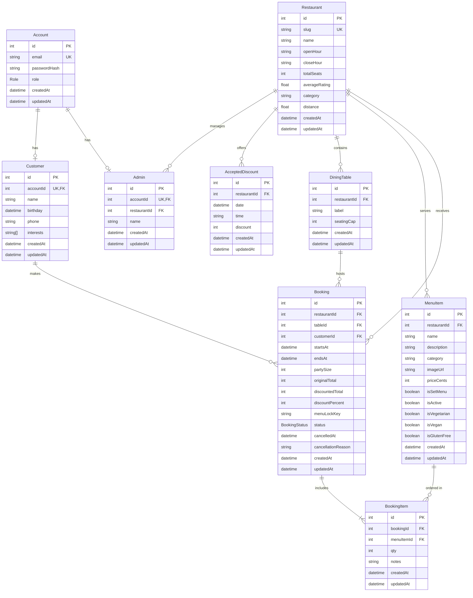

# Database Schema Overview

The Prisma schema in `apps/web/prisma/schema.prisma` models the restaurant booking domain, including authentication, restaurant metadata, menu management, and booking workflows. This document summarizes each model, its key fields, relationships, and notable constraints that affect application logic.

## Entity Relationship Diagram

## Conventions & Cross-Cutting Details
- Primary keys are `Int` with `@default(autoincrement())`.
- `createdAt` defaults to `now()` and `updatedAt` uses `@updatedAt` on nearly every table.
- Foreign keys generally cascade on delete from parent records, except where preserving history matters (e.g., bookings retain table/customer references with `onDelete: Restrict`).
- Prisma enums: `Role` (`CUSTOMER`, `ADMIN`) and `BookingStatus` (`BOOKED`, `COMPLETED`, `CANCELLED`).

## Core Entities

### `Restaurant`
- **Fields**: `slug` (unique), `name`, `openHour`, `closeHour`, `totalSeats`, optional metadata (ratings, category, distance).
- **Relations**:
  - `acceptedDiscounts` → `AcceptedDiscount[]`
  - `admins` → `Admin[]`
  - `tables` → `DiningTable[]`
  - `menuItems` → `MenuItem[]`
  - `bookings` → `Booking[]`
- **Indexes**: `@@index([slug])` to speed up slug lookups.
- **Notes**: Acts as the root entity for most other records; deleting a restaurant cascades to discounts, tables, menu items, and bookings.

### `AcceptedDiscount`
- **Purpose**: Stores time-boxed discounts generated by the model server or admin overrides.
- **Key Fields**: `restaurantId`, `date` (UTC midnight), `time` (`"HH:MM"`), `discount` (0–100).
- **Constraints**:
  - `@@unique([restaurantId, date, time])` ensures one discount per hour slot per day.
  - Indexed by `(restaurantId, date)` and `(restaurantId, time)` for daily queries and slot lookups.
- **Relation**: Belongs to a single `Restaurant` (`onDelete: Cascade`).

## Authentication & People

### `Account`
- **Fields**: `email` (unique), optional `passwordHash`, `role` (default `CUSTOMER`).
- **Relations**:
  - Optional `customer` → `Customer?`
  - Optional `admin` → `Admin?`
- **Notes**: Represents a login identity. Each account links to exactly one profile type; application code determines which profile to create based on role.

### `Customer`
- **Fields**: `accountId` (unique FK), `name`, optional `birthday`, `phone`, `interests` (`String[]`, default empty).
- **Relations**:
  - `account` → `Account` (`onDelete: Cascade`)
  - `bookings` → `Booking[]`
- **Notes**: Interests are surfaced in table guest summaries. Deleting the account cascades and removes the customer record.

### `Admin`
- **Fields**: `accountId` (unique FK), `restaurantId`, `name`.
- **Relations**:
  - `account` → `Account` (`onDelete: Cascade`)
  - `restaurant` → `Restaurant` (`onDelete: Cascade`)
- **Indexes**: `@@index([restaurantId])` to filter admins per restaurant.
- **Notes**: Each admin manages exactly one restaurant. Deleting the restaurant removes dependent admins.

## Seating & Menu

### `DiningTable`
- **Fields**: `restaurantId`, `label`, `seatingCap`.
- **Relations**:
  - `restaurant` → `Restaurant` (`onDelete: Cascade`)
  - `bookings` → `Booking[]`
- **Constraints**:
  - `@@unique([restaurantId, label])` prevents duplicate table labels within a restaurant.
  - Indexed by `(restaurantId)` for capacity queries.
- **Notes**: Seat calculations are handled in application logic; the database enforces table ownership and uniqueness only.

### `MenuItem`
- **Fields**: `restaurantId`, `name`, optional `description`, `category`, `imageUrl`, pricing and dietary flags (`priceCents`, `isSetMenu`, `isActive`, `isVegetarian`, `isVegan`, `isGlutenFree`).
- **Relations**:
  - `restaurant` → `Restaurant` (`onDelete: Cascade`)
  - `bookingItems` → `BookingItem[]`
- **Indexes**:
  - `(restaurantId, isActive)` for active menu lookups.
  - `(restaurantId, category)` for menu filtering.
- **Notes**: Stored price uses integer cents to avoid floating point rounding issues.

### `BookingItem`
- **Fields**: `bookingId`, `menuItemId`, `qty`, optional `notes`.
- **Relations**:
  - `booking` → `Booking` (`onDelete: Cascade`)
  - `menuItem` → `MenuItem` (`onDelete: Restrict`)
- **Indexes**: On `bookingId`, `menuItemId`, and the pair `(bookingId, menuItemId)` for analytics and duplication checks.
- **Notes**: Restricting delete on `MenuItem` prevents orphaned booking history; menu items must be deactivated instead of removed.

## Bookings

### `Booking`
- **Fields**:
  - Foreign keys: `restaurantId`, `tableId`, `customerId`.
  - Timing: `startsAt`, `endsAt` (2-hour window, enforced in application logic).
  - Guests: `partySize`.
  - Pricing: `originalTotal`, `discountedTotal`, `discountPercent`.
  - `menuLockKey` for enforcing consistent set menus across overlapping bookings.
  - Status & cancellation metadata: `status`, `cancelledAt`, `cancellationReason`.
- **Relations**:
  - `restaurant` → `Restaurant` (`onDelete: Cascade`)
  - `table` → `DiningTable` (`onDelete: Restrict`)
  - `customer` → `Customer` (`onDelete: Restrict`)
  - `items` → `BookingItem[]`
- **Indexes**:
  - `(restaurantId, startsAt)`, `(customerId, startsAt)`, `(tableId, startsAt)` for availability checks.
  - Composite indexes with `status` to accelerate filtered dashboards.
  - `(restaurantId, startsAt, menuLockKey)` speeds up menu-lock enforcement.
- **Constraints**:
  - `@@unique([customerId, tableId, startsAt])` prevents duplicate bookings for the same table/time by one customer.
- **Notes**: Restrict delete on tables/customers ensures historical bookings remain intact unless reassigned manually.

## Enums

### `Role`
- Values: `CUSTOMER`, `ADMIN`.
- Used by `Account.role` to drive conditional profile creation and authorization logic.

### `BookingStatus`
- Values: `BOOKED`, `COMPLETED`, `CANCELLED`.
- Stored on `Booking.status`; drives dashboard filters and cancellation flows.

## Relationship Summary
- `Restaurant` ← `Admin`, `DiningTable`, `MenuItem`, `AcceptedDiscount`, `Booking`.
- `Account` ← `Customer` or `Admin` (one-to-one).
- `Customer` ← `Booking` (one-to-many).
- `DiningTable` ← `Booking` (one-to-many).
- `MenuItem` ← `BookingItem` (one-to-many).
- `Booking` ← `BookingItem` (one-to-many).

When designing migrations or new features, ensure that cascading deletions align with business needs (e.g., avoid removing historical bookings by deleting a table) and that application logic continues enforcing seat counts, 2-hour windows, and menu-lock invariants that are not encoded directly in the schema.

